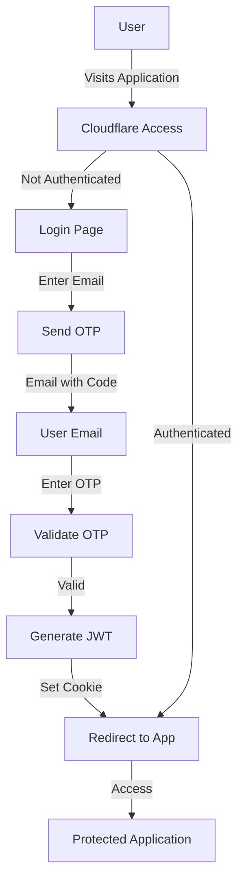

# Cloudflare Access Implementation Plan

## Overview

This document outlines the implementation plan for adding authentication to the meal planning application using Cloudflare Access with One-Time PIN (email-based authentication). This will allow users to securely access the application without needing to set up and maintain a separate authentication server.

## Implementation Steps

### Phase 1: Set Up Cloudflare Access

1. **Set up Cloudflare Zero Trust**
   - Log in to your Cloudflare dashboard
   - Navigate to "Access" or "Zero Trust" section
   - Complete the initial setup process
   - Test: Verify Zero Trust dashboard is accessible

2. **Configure Identity Provider (One-Time PIN)**
   - In Zero Trust dashboard, go to "Settings" > "Authentication"
   - Enable "One-time PIN" as an authentication method
   - Configure email settings (customize email templates if needed)
   - Test: Send a test email to verify OTP delivery

3. **Create an Application in Cloudflare Access**
   - Go to "Access" > "Applications"
   - Click "Add an application" > "Self-hosted"
   - Enter your application details:
     - Name: "Meal Planning App"
     - Session Duration: 24 hours (or your preference)
     - Domain: Your Cloudflare Pages domain (e.g., your-app.pages.dev)
   - Test: Verify application appears in the Access dashboard

4. **Configure Access Policies**
   - In your application settings, go to "Policies"
   - Create a new policy:
     - Name: "Allow Authenticated Users"
     - Action: "Allow"
     - Include: "Emails" (you can specify allowed email addresses or domains)
   - Test: Try accessing your application and verify the authentication flow

### Phase 2: Integrate with SvelteKit Application

5. **Update Application Configuration**
   - Modify your wrangler.toml to include necessary bindings
   - Add environment variables for authentication if needed
   - Test: Verify configuration changes are applied correctly

6. **Create Authentication Helpers**
   - Create utility functions to handle authentication state
   - Implement functions to check user authentication status
   - Test: Verify helper functions work as expected

7. **Implement Protected Routes**
   - Update your SvelteKit routes to check for authentication
   - Create a layout that handles authentication state
   - Test: Verify protected routes redirect unauthenticated users

8. **Add User Information Display**
   - Update your UI to show the current user's information
   - Add a logout button if needed
   - Test: Verify user information is displayed correctly

### Phase 3: Testing and Deployment

9. **Local Testing**
   - Test the authentication flow locally
   - Verify that protected routes work as expected
   - Test: Complete end-to-end authentication flow

10. **Deployment to Cloudflare Pages**
    - Deploy your updated application to Cloudflare Pages
    - Configure any necessary environment variables
    - Test: Verify authentication works in the production environment

11. **User Acceptance Testing**
    - Test with multiple users and devices
    - Verify email delivery and login process
    - Test: Ensure all users can authenticate successfully

## Technical Implementation Details

### Cloudflare Access Configuration



### SvelteKit Integration

For SvelteKit, we'll use Cloudflare Access's JWT validation to verify authentication. When a user accesses your application:

1. Cloudflare Access checks if the user is authenticated
2. If not, they're redirected to the Cloudflare Access login page
3. After authentication, they're redirected back to your application with a JWT
4. Your application can access user information from the JWT

### Code Examples

#### 1. Authentication Check in SvelteKit Layout

```javascript
// src/routes/+layout.server.js
export async function load({ request }) {
  // Cloudflare Access sets the CF-Access-JWT-Assertion header
  const jwt = request.headers.get('CF-Access-JWT-Assertion');
  
  if (!jwt) {
    // User is not authenticated
    return {
      user: null
    };
  }
  
  // Parse JWT to get user info
  const userInfo = parseJwt(jwt);
  
  return {
    user: {
      email: userInfo.email,
      // Other user properties as needed
    }
  };
}

function parseJwt(token) {
  // Simple JWT parsing (in production, use a proper JWT library)
  const base64Url = token.split('.')[1];
  const base64 = base64Url.replace(/-/g, '+').replace(/_/g, '/');
  return JSON.parse(atob(base64));
}
```

#### 2. Protected Route Example

```javascript
// src/routes/protected/+page.server.js
export function load({ parent }) {
  const { user } = await parent();
  
  if (!user) {
    // Redirect to login if not authenticated
    return {
      status: 302,
      redirect: '/login'
    };
  }
  
  return {
    // Your protected data here
  };
}
```

#### 3. Display User Info in UI

```svelte
<!-- src/routes/+layout.svelte -->
<script>
  export let data;
  const { user } = data;
</script>

<header>
  {#if user}
    <div class="user-info">
      Logged in as: {user.email}
    </div>
  {:else}
    <div class="login-prompt">
      Please log in to access the application
    </div>
  {/if}
</header>

<main>
  <slot />
</main>
```

## Testing Plan

For each phase, we'll implement specific tests to ensure everything works correctly:

### Phase 1 Tests

1. **Zero Trust Setup Test**
   - Verify Cloudflare Zero Trust dashboard is accessible
   - Expected result: Dashboard loads without errors

2. **OTP Configuration Test**
   - Send a test OTP email
   - Expected result: Email is received with a valid OTP code

3. **Application Access Test**
   - Try accessing the application URL
   - Expected result: Redirected to Cloudflare Access login page

### Phase 2 Tests

4. **Authentication Helper Test**
   - Test authentication helper functions
   - Expected result: Functions correctly identify authenticated/unauthenticated states

5. **Protected Route Test**
   - Try accessing a protected route without authentication
   - Expected result: Redirected to login page

6. **User Info Display Test**
   - Log in and check if user information is displayed
   - Expected result: User email is correctly displayed in the UI

### Phase 3 Tests

7. **End-to-End Authentication Test**
   - Complete the entire authentication flow
   - Expected result: Successfully authenticated and can access protected content

8. **Production Deployment Test**
   - Deploy to production and test authentication
   - Expected result: Authentication works in the production environment

9. **Multi-User Test**
   - Test with multiple users simultaneously
   - Expected result: All users can authenticate independently

## Timeline Estimate

- Phase 1 (Cloudflare Access Setup): 1-2 days
- Phase 2 (SvelteKit Integration): 2-3 days
- Phase 3 (Testing and Deployment): 1-2 days

Total estimated time: 4-7 days

## Resources Needed

1. Cloudflare account with Access capability
2. Access to your SvelteKit application codebase
3. Test email accounts for authentication testing