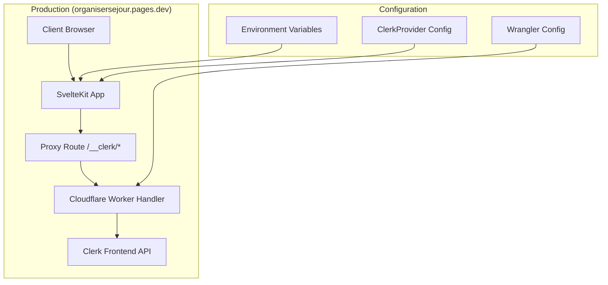

# 🚀 Guide de Mise en Production Clerk avec Proxy

## 📋 Contexte

Ce guide détaille la mise en place d'un proxy Clerk pour la production sur Cloudflare Pages, permettant d'utiliser votre propre domaine pour toutes les requêtes d'authentification.

### ✅ État actuel
- Clerk fonctionne en local avec clés de développement (`pk_test_...`)
- Application déployée sur `organisersejour.pages.dev`
- Configuration Wrangler existante

### 🎯 Objectif
- Mettre en place un proxy Clerk pour la production
- Utiliser les clés de production (`pk_live_...`)
- Toutes les requêtes d'auth passent par `organisersejour.pages.dev/__clerk`

## 🏗️ Architecture



## 🔧 Plan d'Implémentation

### Étape 1 : Créer le Proxy Handler

**Fichier à créer :** `src/routes/api/__clerk/[...path]/+server.ts`

```typescript
import type { RequestHandler } from '@sveltejs/kit';

export const GET: RequestHandler = async ({ params, request, platform }) => {
  return handleClerkProxy(params, request, platform);
};

export const POST: RequestHandler = async ({ params, request, platform }) => {
  return handleClerkProxy(params, request, platform);
};

export const PUT: RequestHandler = async ({ params, request, platform }) => {
  return handleClerkProxy(params, request, platform);
};

export const DELETE: RequestHandler = async ({ params, request, platform }) => {
  return handleClerkProxy(params, request, platform);
};

async function handleClerkProxy(params: any, request: Request, platform: any) {
  const path = params.path || '';
  const clerkFapi = platform?.env?.CLERK_FAPI || 'https://frontend-api.clerk.dev';
  const clerkSecretKey = platform?.env?.CLERK_SECRET_KEY;
  const clerkProxyUrl = platform?.env?.CLERK_PROXY_URL;

  if (!clerkSecretKey) {
    return new Response('Clerk Secret Key not configured', { status: 500 });
  }

  // Construire l'URL de destination
  const targetUrl = `${clerkFapi}/${path}${request.url.includes('?') ? '?' + request.url.split('?')[1] : ''}`;

  // Copier les headers de la requête originale
  const headers = new Headers(request.headers);
  
  // Ajouter les headers requis par Clerk
  headers.set('Clerk-Proxy-Url', clerkProxyUrl || '');
  headers.set('Clerk-Secret-Key', clerkSecretKey);
  headers.set('X-Forwarded-For', request.headers.get('CF-Connecting-IP') || request.headers.get('X-Forwarded-For') || '');

  try {
    // Faire la requête vers l'API Clerk
    const response = await fetch(targetUrl, {
      method: request.method,
      headers,
      body: request.method !== 'GET' && request.method !== 'HEAD' ? await request.arrayBuffer() : undefined,
    });

    // Retourner la réponse avec les headers appropriés
    const responseHeaders = new Headers(response.headers);
    responseHeaders.set('Access-Control-Allow-Origin', '*');
    responseHeaders.set('Access-Control-Allow-Methods', 'GET, POST, PUT, DELETE, OPTIONS');
    responseHeaders.set('Access-Control-Allow-Headers', '*');

    return new Response(response.body, {
      status: response.status,
      statusText: response.statusText,
      headers: responseHeaders,
    });
  } catch (error) {
    console.error('Clerk proxy error:', error);
    return new Response('Proxy error', { status: 500 });
  }
}
```

### Étape 2 : Modifier la Configuration Wrangler

**Fichier à modifier :** `wrangler.toml`

```toml
# Ajouter dans [vars] pour l'environnement par défaut
[vars]
AUTH_ENABLED = "true"
ENVIRONMENT = "dev"
# ... autres variables existantes ...
CLERK_FAPI = "https://frontend-api.clerk.dev"

# Ajouter dans [env.preview]
[env.preview]
vars = { 
  ENVIRONMENT = "preprod", 
  AUTH_ENABLED = "true",
  CLERK_PROXY_URL = "https://organisersejour-preview.pages.dev/__clerk",
  CLERK_FAPI = "https://frontend-api.clerk.dev"
}

# Ajouter dans [env.production]
[env.production]
vars = { 
  ENVIRONMENT = "prod", 
  AUTH_ENABLED = "true",
  CLERK_PROXY_URL = "https://organisersejour.pages.dev/__clerk",
  CLERK_FAPI = "https://frontend-api.clerk.dev"
}
```

### Étape 3 : Modifier ClerkProvider pour le Proxy

**Fichier à modifier :** `src/lib/components/ClerkProvider.svelte`

```svelte
<script lang="ts">
  import { onMount } from 'svelte';
  import { initializeClerk, getUserFromClerk, type User } from '$lib/clerk-auth';
  import { writable } from 'svelte/store';

  export let publishableKey: string;
  export let proxyUrl: string | null = null; // Nouveau prop
  export let user: User | null = null;
  export let requireAuth: boolean = false;

  // ... reste du code existant ...

  onMount(async () => {
    console.log('[ClerkProvider] Initializing with publishableKey:', publishableKey);
    console.log('[ClerkProvider] Proxy URL:', proxyUrl);
    
    if (!publishableKey) {
      clerkError = 'Clerk publishable key is required';
      return;
    }

    try {
      // Passer l'URL du proxy à l'initialisation
      const options = proxyUrl ? { proxyUrl } : {};
      await initializeClerk(publishableKey, options);
      
      clerkLoaded = true;
      currentUser = getUserFromClerk();
      userStore.set(currentUser);
      
      console.log('Clerk initialized successfully', currentUser);
    } catch (error) {
      console.error('Failed to initialize Clerk:', error);
      clerkError = 'Failed to initialize authentication';
      clerkLoaded = true;
    }
  });

  // ... reste du code existant ...
</script>
```

### Étape 4 : Modifier clerk-auth.ts pour le Proxy

**Fichier à modifier :** `src/lib/clerk-auth.ts`

```typescript
export async function initializeClerk(publishableKey: string, options?: any): Promise<any> {
  if (typeof window === 'undefined') {
    return null;
  }
  
  console.log('🔍 [DIAGNOSTIC] Clerk publishableKey:', publishableKey);
  console.log('🔍 [DIAGNOSTIC] Clerk options:', options);
  
  if (!clerk) {
    const { Clerk } = await import('@clerk/clerk-js');
    clerk = new Clerk(publishableKey, options);
    await clerk.load();
  }
  return clerk;
}
```

### Étape 5 : Modifier le Layout Server

**Fichier à modifier :** `src/routes/+layout.server.ts`

```typescript
export const load: LayoutServerLoad = async ({ locals, platform, url }) => {
  // ... code existant ...
  
  const clerkPublishableKey = locals.clerkPublishableKey ?? platform?.env?.CLERK_PUBLISHABLE_KEY;
  const clerkProxyUrl = platform?.env?.CLERK_PROXY_URL;
  
  console.log('🔍 [DIAGNOSTIC] Clerk proxy URL:', clerkProxyUrl);
  
  return {
    user: locals.user,
    authEnabled: true,
    clerkPublishableKey,
    clerkProxyUrl // Nouveau
  };
}
```

### Étape 6 : Modifier le Layout Principal

**Fichier à modifier :** `src/routes/+layout.svelte`

```svelte
<script lang="ts">
  import ClerkProvider from '$lib/components/ClerkProvider.svelte';
  import ClerkAuth from '$lib/components/ClerkAuth.svelte';

  export let data: any;

  $: ({ user, authEnabled, clerkPublishableKey, clerkProxyUrl } = data);
</script>

<!-- ... reste du template ... -->

{#if authEnabled && clerkPublishableKey}
  <ClerkProvider 
    publishableKey={clerkPublishableKey} 
    proxyUrl={clerkProxyUrl}
    {user} 
    let:user={currentUser}
  >
    <!-- ... reste du contenu ... -->
  </ClerkProvider>
{:else}
  <!-- ... mode sans authentification ... -->
{/if}
```

## 🔐 Configuration des Variables d'Environnement

### Dans Cloudflare Dashboard

1. **Aller dans Cloudflare Pages Dashboard**
2. **Sélectionner votre projet** `organisersejour`
3. **Settings > Environment Variables**

#### Variables pour Production :
```
CLERK_PUBLISHABLE_KEY = pk_live_votre_cle_publique_production
CLERK_SECRET_KEY = sk_live_votre_cle_secrete_production
CLERK_PROXY_URL = https://organisersejour.pages.dev/__clerk
CLERK_FAPI = https://frontend-api.clerk.dev
```

#### Variables pour Preview :
```
CLERK_PUBLISHABLE_KEY = pk_test_votre_cle_publique_test
CLERK_SECRET_KEY = sk_test_votre_cle_secrete_test
CLERK_PROXY_URL = https://organisersejour-preview.pages.dev/__clerk
CLERK_FAPI = https://frontend-api.clerk.dev
```

## 🎛️ Configuration Dashboard Clerk

### Activer le Proxy

1. **Aller sur [dashboard.clerk.com](https://dashboard.clerk.com)**
2. **Sélectionner votre application de production**
3. **Navigate to Domains page**
4. **Frontend API section > Advanced dropdown**
5. **Proxy URL field :** `https://organisersejour.pages.dev/__clerk`

⚠️ **Important :** Le proxy doit être fonctionnel AVANT d'activer cette configuration !

## 🚀 Déploiement

### Étapes de déploiement :

1. **Commit et push** tous les changements
2. **Vérifier** que Cloudflare Pages build automatiquement
3. **Configurer** les variables d'environnement dans Cloudflare
4. **Tester** l'authentification en production
5. **Activer** le proxy dans le Dashboard Clerk

### Commandes de déploiement :

```bash
# Build local pour vérifier
npm run build

# Déployer via Git (automatique)
git add .
git commit -m "feat: add Clerk proxy for production"
git push origin main

# Ou déployer manuellement
npx wrangler pages deploy build --project-name=organisersejour
```

## 🧪 Tests

### Tests à effectuer :

1. **Page d'accueil** : Vérifier que l'app se charge
2. **Connexion** : Tester le processus de login
3. **Déconnexion** : Tester le logout
4. **Pages protégées** : Vérifier l'accès aux routes protégées
5. **Console** : Vérifier l'absence d'erreurs CORS

### URLs de test :
- **Production :** `https://organisersejour.pages.dev`
- **Preview :** `https://organisersejour-preview.pages.dev`

## 🔍 Debugging

### Logs à surveiller :

```javascript
// Dans la console navigateur
console.log('[ClerkProvider] Proxy URL:', proxyUrl);
console.log('Clerk initialized successfully');

// Dans les logs Cloudflare
console.log('Clerk proxy request:', targetUrl);
console.error('Clerk proxy error:', error);
```

### Problèmes courants :

1. **CORS errors** : Vérifier les headers du proxy
2. **500 errors** : Vérifier `CLERK_SECRET_KEY`
3. **404 errors** : Vérifier la route `/__clerk/[...path]`
4. **Auth failures** : Vérifier la configuration Dashboard Clerk

## ✅ Checklist de Mise en Production

- [ ] Proxy handler créé (`/__clerk/[...path]/+server.ts`)
- [ ] Configuration Wrangler mise à jour
- [ ] ClerkProvider modifié pour le proxy
- [ ] Layout server modifié
- [ ] Layout principal modifié
- [ ] Variables d'environnement configurées dans Cloudflare
- [ ] Application buildée et déployée
- [ ] Proxy activé dans Dashboard Clerk
- [ ] Tests d'authentification réussis
- [ ] Logs de diagnostic supprimés (optionnel)

## 🆘 Support

En cas de problème :
1. Vérifier les logs Cloudflare Pages
2. Vérifier la console navigateur
3. Tester avec `AUTH_ENABLED=false` temporairement
4. Contacter support@clerk.com si nécessaire

---

**🎉 Une fois ce guide suivi, votre authentification Clerk fonctionnera en production avec votre propre domaine !**