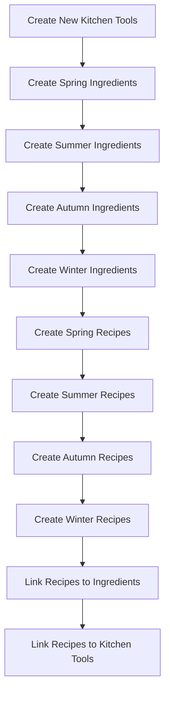

# Seasonal Recipe Generation Plan

## Overview

We'll create a comprehensive set of seasonal recipes to populate the database, with approximately 100 recipes for each of the four seasons (spring, summer, autumn, winter). All recipes and ingredients will be assigned to the 'system' user ID to indicate they are system-provided.

## 1. Seasonal Ingredients Creation

First, we'll create seasonal ingredients for each season. Each ingredient will have:
- Name
- Unit (g, ml, pcs, etc.)
- Type (boisson, pain, condiment, légume, fruit, viande, poisson, autre)
- Season (spring, summer, autumn, winter)
- User ID ('system')

### Spring Ingredients (March-May)
- Vegetables: Asparagus, Artichokes, Spring Onions, Peas, Spinach, Radishes, Rhubarb
- Fruits: Strawberries, Cherries (late spring)
- Herbs: Fresh Mint, Chives, Parsley
- Seafood: Sardines, Mackerel

### Summer Ingredients (June-August)
- Vegetables: Tomatoes, Zucchini, Eggplant, Bell Peppers, Cucumber, Corn
- Fruits: Peaches, Nectarines, Berries (all types), Watermelon, Melon, Apricots
- Herbs: Basil, Cilantro, Rosemary
- Seafood: Tuna, Sea Bass

### Autumn Ingredients (September-November)
- Vegetables: Pumpkin, Butternut Squash, Sweet Potatoes, Brussels Sprouts, Cauliflower
- Fruits: Apples, Pears, Grapes, Figs, Plums
- Mushrooms: Chanterelles, Porcini, Shiitake
- Meat: Game (Venison, Wild Boar)

### Winter Ingredients (December-February)
- Vegetables: Kale, Cabbage, Leeks, Turnips, Parsnips, Potatoes
- Fruits: Citrus (Oranges, Clementines), Pomegranates
- Meat: Duck, Beef for stews
- Pantry items: Dried beans, Lentils

## 2. Additional Kitchen Tools

We'll add more specialized kitchen tools to support complex recipes:

- Pressure cooker
- Slow cooker
- Food processor
- Blender
- Stand mixer
- Mandoline
- Zester/Grater
- Mortar and pestle
- Thermometer
- Pastry brush
- Rolling pin
- Baking stone
- Steamer basket
- Grill pan
- Immersion blender

## 3. Recipe Generation Structure

For each season, we'll create approximately 100 recipes distributed across:

### Meal Types
- Breakfast (20%)
- Lunch (40%)
- Dinner (40%)

### Course Types
- Starters/Appetizers (20%)
- Main Dishes (40%)
- Side Dishes (20%)
- Desserts (20%)

### Complexity Mix
- Simple recipes (60%): 5-7 ingredients, basic instructions, common kitchen tools
- Complex recipes (40%): 8+ ingredients, detailed instructions, specialized techniques, more kitchen tools

## 4. Recipe Components

Each recipe will include:
- Name (descriptive and seasonal)
- Description (brief overview)
- Preparation time (minutes)
- Cooking time (minutes)
- Detailed instructions
- Servings (typically 2-4)
- Season tag
- User ID ('system')
- Ingredients list with quantities
- Required kitchen tools

## 5. Implementation Approach

We'll implement this plan using SQL migrations to:

1. Create new kitchen tools
2. Create seasonal ingredients
3. Create recipes for each season
4. Link recipes to ingredients with quantities
5. Link recipes to kitchen tools

### SQL Migration Structure



## 6. Example Recipes for Each Season

### Spring Example
```
Recipe: Spring Asparagus Risotto
Season: spring
Meal Type: dinner
Course Type: main
Complexity: complex
Ingredients:
  - Arborio rice (200g)
  - Asparagus (200g)
  - Spring onions (3 pcs)
  - White wine (100ml)
  - Vegetable stock (1L)
  - Parmesan cheese (50g)
  - Butter (30g)
  - Olive oil (15ml)
  - Lemon (1 pcs)
  - Fresh mint (5 leaves)
Kitchen Tools:
  - Saucepan
  - Cutting board
  - Knife
  - Wooden spoon
  - Ladle
  - Zester
```

### Summer Example
```
Recipe: Fresh Tomato Gazpacho
Season: summer
Meal Type: lunch
Course Type: starter
Complexity: simple
Ingredients:
  - Tomatoes (500g)
  - Cucumber (1 pcs)
  - Red bell pepper (1 pcs)
  - Red onion (1/2 pcs)
  - Garlic (1 clove)
  - Olive oil (30ml)
  - Red wine vinegar (15ml)
  - Bread (50g)
Kitchen Tools:
  - Blender
  - Knife
  - Cutting board
  - Bowl
```

### Autumn Example
```
Recipe: Pumpkin Spice Pancakes
Season: autumn
Meal Type: breakfast
Course Type: main
Complexity: simple
Ingredients:
  - Flour (200g)
  - Pumpkin puree (150g)
  - Eggs (2 pcs)
  - Milk (200ml)
  - Cinnamon (5g)
  - Nutmeg (2g)
  - Baking powder (5g)
  - Butter (30g)
  - Maple syrup (50ml)
Kitchen Tools:
  - Mixing bowl
  - Whisk
  - Pan
  - Spatula
```

### Winter Example
```
Recipe: Slow-Cooked Beef Bourguignon
Season: winter
Meal Type: dinner
Course Type: main
Complexity: complex
Ingredients:
  - Beef chuck (800g)
  - Bacon (100g)
  - Red wine (300ml)
  - Beef stock (300ml)
  - Carrots (3 pcs)
  - Onions (2 pcs)
  - Garlic (3 cloves)
  - Mushrooms (200g)
  - Thyme (5g)
  - Bay leaves (2 pcs)
  - Flour (30g)
  - Butter (30g)
Kitchen Tools:
  - Slow cooker
  - Dutch oven
  - Knife
  - Cutting board
  - Wooden spoon
```

## 7. Technical Implementation Details

### SQL Migration File Structure

We'll create a new migration file that will:

1. Insert new kitchen tools
2. Insert seasonal ingredients with appropriate types and seasons
3. Insert recipes with seasonal tags
4. Link recipes to ingredients with quantities
5. Link recipes to kitchen tools

The migration will be structured to ensure all foreign key relationships are maintained correctly.

### Data Generation Approach

To efficiently generate the large number of recipes and their relationships, we'll:

1. Create a template structure for each recipe type
2. Vary ingredients based on season while maintaining culinary coherence
3. Ensure a good distribution of meal types, course types, and complexity
4. Generate realistic preparation and cooking times based on complexity
5. Create detailed, step-by-step instructions for each recipe

## 8. Testing and Validation

After implementing the migration, we'll:

1. Verify that all recipes are correctly associated with their ingredients and kitchen tools
2. Ensure proper distribution across seasons, meal types, and course types
3. Validate that the user interface correctly displays seasonal recipes
4. Test filtering and searching functionality with the new data

## 9. Future Enhancements

Once the initial set of recipes is created, we could consider:

1. Adding nutritional information to recipes
2. Creating recipe tags (vegetarian, vegan, gluten-free, etc.)
3. Implementing recipe ratings or popularity metrics
4. Adding recipe images or placeholder image URLs